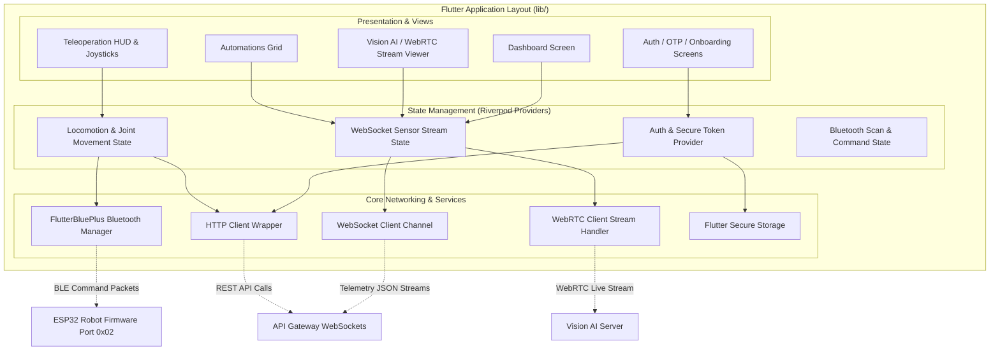

# 📱 REX-47 Mobile Companion App (v1.0.0)

> **Repository `04`** · Premium, high-fidelity Flutter companion application for the REX-47 autonomous platform. Implements a purple-themed glassmorphic dashboard, dual-joystick teleoperation HUD with real-time video stream overlay, BLE local control switching via `flutter_blue_plus`, WebSockets for telemetry streams, and secure storage for JWT-validated tokens.

[]()
[]()
[]()
[]()
[]()
[]()

---

## 🧭 System Architecture

The mobile application utilizes a features-first Clean Architecture directory system, managing network connections, secure tokens, and local/remote telemetry operations.



---

## 📦 Project Structure

```
04-rex-mobile-app/
├── android/                  # Native Android build configurations
├── ios/                      # Native iOS build configurations
├── assets/                   # Fonts, vector graphics, and onboard animations
├── lib/
│   ├── core/                 # Shared central architecture modules
│   │   ├── network/          # API helpers, WebSocket drivers, and WebRTC configs
│   │   ├── providers/        # Riverpod global application state managers
│   │   ├── router/           # GoRouter client-side routing definitions & guards
│   │   ├── theme/            # Accent layouts, dark/light setups, and typographies
│   │   └── utils/            # Validators, formats, and hardware permission managers
│   ├── features/             # Feature-specific implementations
│   │   ├── onboarding/       # Startup tutorials & system sweeps
│   │   ├── auth/             # Account credentials, OTP, and registration panels
│   │   ├── connection/       # BLE scans, WebSocket setups, and broker configs
│   │   ├── control/          # Virtual joysticks, joint sliders, and speeds
│   │   ├── dashboard/        # Unified status metrics widgets grid
│   │   ├── vision/           # WebRTC camera feeds and object annotation overlays
│   │   ├── automation/       # Smart home automation rules and calendars
│   │   ├── events/           # Live warning, info, and crash logging alerts
│   │   ├── assistant/        # Chat interface, wake-word, and vocal feedback
│   │   ├── media/            # Teleop snapshots & stream recordings library
│   │   ├── analytics/        # Power metrics & hardware load graphing dashboards
│   │   ├── profile/          # Profiles settings & security token views
│   │   ├── config/           # App runtime parameters configuration
│   │   ├── robots/           # Managed lists of paired and network robots
│   │   └── notifications/    # Local pushes and push notification handlers
│   ├── shared/               # Reusable glassmorphic layouts & custom buttons
│   ├── widgets/              # Global UI helpers
│   └── main.dart             # App startup mounter
├── packages/
│   └── lucide_icons/         # Dedicated internal vector icon set package
├── pubspec.yaml              # App dependencies list & asset register
└── README.md                 # This file
```

---

## 📡 Connectivity & Hybrid Protocols

To guarantee real-time response times and stable remote operations, the mobile client implements a hybrid communication framework:

### 1. Bluetooth Low Energy (BLE)
For close-proximity, low-latency teleoperations (bypassing cloud routers), the app communicates directly with the robot's ESP32 microcontroller using `flutter_blue_plus`:
* **Broadcast Target ID**: `REX_47_BLE`
* **Service UUID**: `4fafc201-1fb5-459e-8fcc-c5c9c331914b`
* **Characteristic UUID**: `beb5483e-36e1-4688-b7f5-ea07361b26a8`
* **Local Control Commands**:
  * Locomotion drive: `M:<x>:<y>` or `M:<direction>:<speed>`
  * Pan-tilt camera sweep: `J:<servo_index>:<angle>` (e.g. `J:0:90`)
  * Joint coordinates target: `A:<pan_angle>:<tilt_angle>` (e.g. `A:90.0:120.0`)
  * Emergency Stop: `ESTOP`

### 2. HTTP REST Client
Used for configuration settings, user sign-ups, and managing paired robot registers via the HTTP API Gateway:
* Uses a standardized HTTP wrapper carrying bearer tokens parsed from secure local memory.

### 3. Persistent WebSockets
Establishes a persistent socket connection to stream real-time sensor metrics:
* Ingests JSON packages updating battery voltages, compute temperatures, ultrasonic distance metrics, and IR line sensors.

### 4. Low-Latency WebRTC Stream
Establishes connection endpoints via `flutter_webrtc` to overlay real-time video frames from the robot's camera with custom bounding box annotations (e.g. human face recognition, object boundary shapes).

---

## 🎨 Design Identity (Aesthetics & UX)

The visual design is optimized for high-end aesthetics, premium interactions, and screen legibility:
* **Glassmorphic UI**: Translucent, blurred card structures generated using native `BackdropFilter` widgets layered over rich background gradients.
* **Branded Themes**: Dark-mode visual configurations highlighted with purple accent colors.
* **Modern Typography**: Smooth text interfaces rendered using Google Fonts (`Inter` and `Outfit`).
* **Fluid Micro-Animations**: Page transitions, tab switching, and button hover states animated using custom animation curves.

---

## 🛠️ Compilation & Getting Started

### Prerequisites
* **Flutter SDK**: `^3.11.5`
* **Dart SDK**: compatible version
* **IDE**: Android Studio / VS Code / Xcode (for iOS)
* **Cocoapods**: Required for iOS dependency compiling

### Development Steps

1. **Clone the repository**
   ```bash
   git clone https://github.com/thathsarabandara/04-rex-mobile-app.git
   cd 04-rex-mobile-app
   ```

2. **Pull dependencies**
   ```bash
   flutter pub get
   ```

3. **Verify Connected Emulators or Hardware**
   ```bash
   flutter devices
   ```

4. **Launch Local Debugger**
   ```bash
   flutter run
   ```

### Building Release Files
Generate compilation bundles for distribution:
```bash
# Build Android APK file
flutter build apk --release

# Build iOS App Bundle
flutter build ipa --release
```

---

## 📦 Core Dependencies

The application relies on these main plugins defined in [pubspec.yaml](pubspec.yaml):

| Package | Purpose | Category |
|---|---|---|
| `flutter_riverpod` | State management and dependency injection | State |
| `go_router` | Declarative, screen-split client routing | Routing |
| `flutter_blue_plus` | Bluetooth Low Energy scanning and command transmission | Hardware |
| `web_socket_channel` | Telemetry channel handlers | Networking |
| `flutter_webrtc` | Low-latency WebRTC streams overlay renderers | Video |
| `flutter_secure_storage` | Storing user JWT access/refresh tokens in keychain/keystore | Security |
| `google_fonts` | Typography configurations | UI |

---

## 📈 Feature Roadmap

| Feature Module | Description | Status |
|:---:|---|:---:|
| **Design** | Purple-themed glassmorphism interface configurations | ✅ Implemented |
| **Tutorial** | Onboarding layouts explaining system capabilities | ✅ Implemented |
| **Security** | JWT session authentication with Secure Storage | ✅ Implemented |
| **BLE** | Bluetooth device scans & control commands | ✅ Implemented |
| **Locomotion** | Virtual joystick driving & camera pan-tilt sliders | ✅ Implemented |
| **Gauges** | Real-time voltage, current, and temperature trackers | ✅ Implemented |
| **Automate** | Smart Home schedules and automation grid builders | ✅ Implemented |
| **Video** | Live camera overlay with object markings | ✅ Implemented |
| **WebSockets** | Telemetry ingestion and logging | ✅ Implemented |
| **Audio** | Real-time voice assistant input and feedback | ⏳ Planned |
| **SLAM** | SLAM mapping and path grid visualization | ⏳ Planned |

---

<div align="center">
  <sub>Part of the <strong>REX-47</strong> Autonomous Robotic Platform Ecosystem</sub>
</div>
